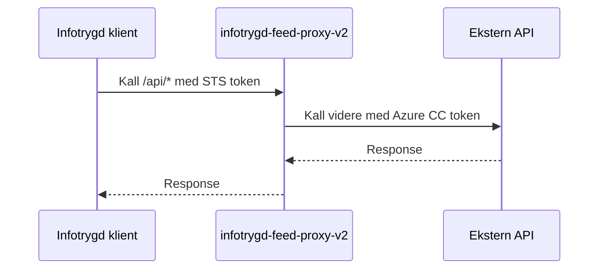

# infotrygd-feed-proxy-v2

Applikasjon som kan brukes mellom gcp<->on-prem for kommunikasjon med infotrygd tjenester. Eks. for infotrygd som kaller 
på familie-baks-infotrygd-feed med sts token, så mottar denne sts, og kaller videre på familie-baks-infotrygd-feed med
azure-token.

## Eksterne API-kall

Alle innkommende kall går til proxyen under `/api/*` med STS-token (issuer `sts`).
Proxyen kaller deretter videre til eksterne tjenester med Azure client credentials.

### Diagram (oversikt i bokser)

<!-- Merk: Diagrammet viser overordnet flyt; se tabellen under for eksakte endpoint-mappinger. -->

```text
+---------------------------+         +-------------------------------------+         +-----------------------------------+
| Infotrygd                 |         | infotrygd-feed-proxy-v2             |         | Eksterne API-er                   |
| klient -> /api/*          |  STS    | mottar STS, henter Azure CC token   |  Azure  | BAKS_FEED_URL                     |
|                           | ------> | og videresender kall                | ------> | FPSAK_FEED_URL                    |
|                           |         |                                     |         | SYKEPENGER_FEED_URL               |
|                           |         |                                     |         | YRKESSKADE_FEED_URL               |
|                           |         |                                     |         | INST2_URL                         |
|                           |         |                                     |         | OPPGAVE_URL                       |
+---------------------------+         +-------------------------------------+         +-----------------------------------+
```



| Innkommende endpoint (proxy) | Metode | Utgående kall (ekstern API) | Metode | Notat |
|---|---|---|---|---|
| `/api/barnetrygd/v1/feed?sistLesteSekvensId={id}` | GET | `${BAKS_FEED_URL}/api/barnetrygd/v1/feed?sistLesteSekvensId={id}` | GET | Barnetrygd-feed |
| `/api/kontantstotte/v1/feed?sistLesteSekvensId={id}` | GET | `${BAKS_FEED_URL}/api/kontantstotte/v1/feed?sistLesteSekvensId={id}` | GET | Kontantstøtte-feed |
| `/api/fpsak/foreldrepenger/v1/feed?sistLesteSekvensId={id}` | GET | `${FPSAK_FEED_URL}/fpsak/api/feed/vedtak/foreldrepenger?sistLesteSekvensId={id}` | GET | Foreldrepenger-feed |
| `/api/fpsak/svangerskapspenger/v1/feed?sistLesteSekvensId={id}` | GET | `${FPSAK_FEED_URL}/fpsak/api/feed/vedtak/svangerskapspenger?sistLesteSekvensId={id}` | GET | Svangerskapspenger-feed |
| `/api/sykepenger/vedtaksfeed/v1/feed?sistLesteSekvensId={id}` | GET | `${SYKEPENGER_FEED_URL}/feed?sistLesteSekvensId={id}` | GET | Sykepenger vedtaksfeed |
| `/api/yrkesskade/v1/feed?sistLesteSekvensId={id}` | GET | `${YRKESSKADE_FEED_URL}/api/v1/feed?sistLesteSekvensId={id}` | GET | Yrkesskade-feed |
| `/api/inst2/v2/person` | POST | `${INST2_URL}/api/v1/person/institusjonsopphold/soek` | POST | Body: `{ "personident": "..." }` |
| `/api/inst2/v1/personer` | GET | `${INST2_URL}/api/v1/personer/institusjonsopphold/soek` | POST | `Nav-Personident` header blir sendt videre som body-liste |
| `/api/inst2/v2/personer` | POST | `${INST2_URL}/api/v1/personer/institusjonsopphold/soek` | POST | Body: `{ "personidenter": ["..."] }` |
| `/api/inst2/v1/feed?sistLesteSekvensId={id}&antall-hendelser={n}` | GET | `${INST2_URL}/api/v1/hendelse/after-id/{id}?antall-hendelser={n}` | GET | Inst2 hendelsesfeed |
| `/api/oppgave/v1/opprett` | POST | `${OPPGAVE_URL}/api/v1/oppgaver` | POST | Oppretter oppgave |
| `/api/oppgave/v1/ferdigstill` | POST | `${OPPGAVE_URL}/api/v1/oppgaver/{oppgaveId}` | PATCH | Ferdigstiller oppgave |
| `/api/oppgave/v1/ferdigstill/uk` | POST | `${OPPGAVE_URL}/api/v1/oppgaver/{oppgaveId}` | PATCH | Ferdigstiller oppgave (UK) |

### Base-URLer per miljø

| Variabel | Dev | Prod |
|---|---|---|
| `BAKS_FEED_URL` | `https://familie-baks-infotrygd-feed.intern.dev.nav.no` | `https://familie-baks-infotrygd-feed.intern.nav.no` |
| `SYKEPENGER_FEED_URL` | `https://vedtaksfeed.intern.dev.nav.no` | `https://vedtaksfeed.intern.nav.no` |
| `YRKESSKADE_FEED_URL` | `https://yrkesskade-infotrygd-feed.intern.dev.nav.no` | `https://yrkesskade-infotrygd-feed.intern.nav.no` |
| `FPSAK_FEED_URL` | `https://fpsak-api.intern.dev.nav.no` | `https://fpsak-api.intern.nav.no` |
| `INST2_URL` | `https://inst2-q1.dev.intern.nav.no` | `https://inst2.intern.nav.no` |
| `OPPGAVE_URL` | `https://oppgave-q1.intern.dev.nav.no` | `https://oppgave.intern.nav.no` |

### Token og autentisering

- Innkommende kall til proxy krever STS-token (`issuer=sts`).
- Utgående kall går med Azure-token via client credentials (`no.nav.security.jwt.client.registration`).
- Ressurs-scope styres av registreringene i `application.yaml`.

## Deployments
Appen deployes til team infotrygd, både i dev og prod.

## Test
For å teste applikasjon i dev må man bruke sts-token. Slik generer du STS token i dev.
1. Åpne STS swagger-ui med denne lenka 
https://security-token-service.nais.preprod.local/swagger-ui/index.html i Chrome SKSS
2. logger på swagger via username "srvinfotrygd-feed-proxy-v2" og passord. 
3. Passordet finner du enten i vault 
https://vault.adeo.no/ui/vault/secrets/serviceuser/show/dev/srvinfotrygd-feed-proxy-v2 
eller ved å logge på POD.
4. Kall /rest/v1/sts/token tjeneste for å generer et token.
5. Genererte tokenet kan brukes som Bearer token for å logge på swagger-ui
   https://infotrygd-feed-proxy-v2.dev.intern.nav.no/api/swagger-ui/index.html