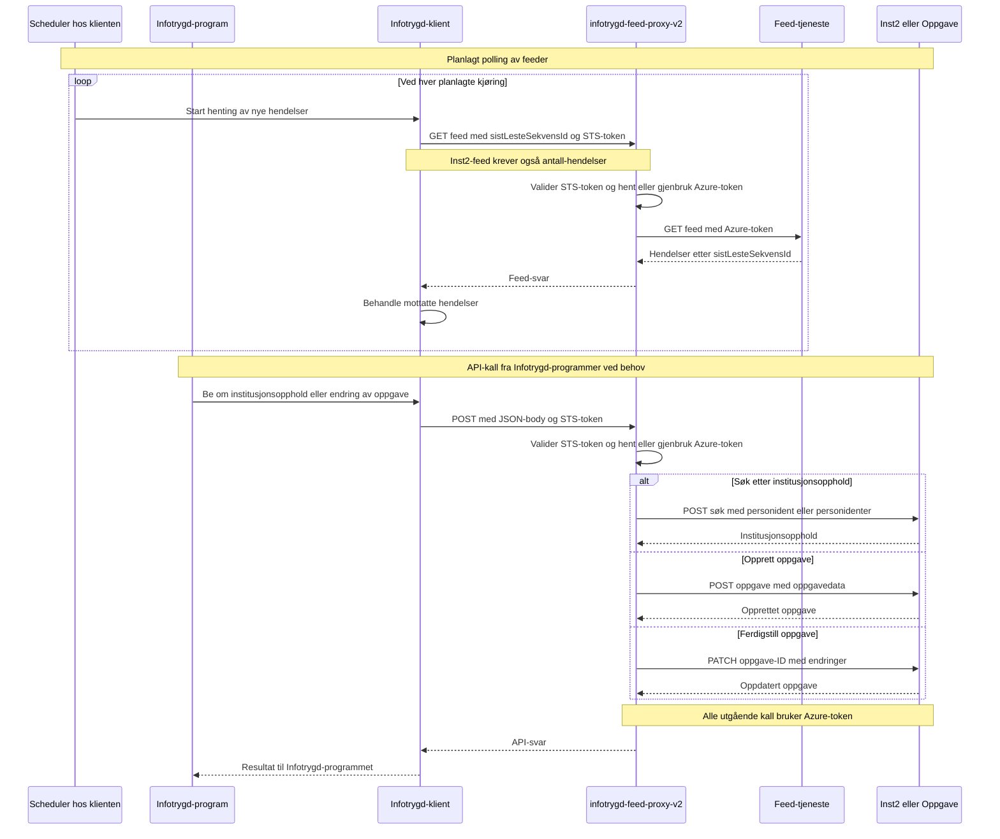
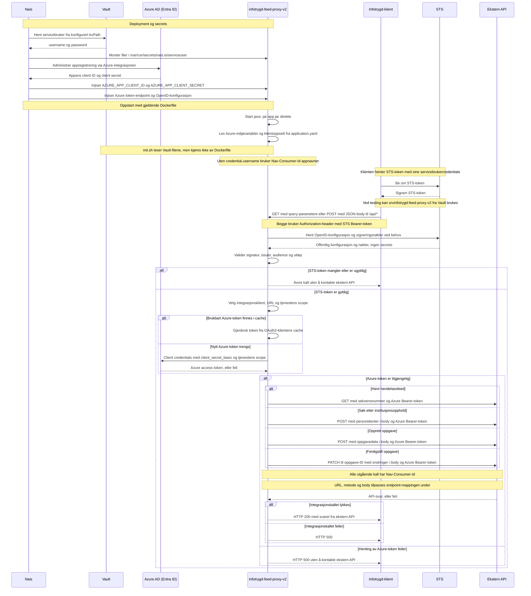

# infotrygd-feed-proxy-v2

Proxy som lar Infotrygd hente og sende data mellom on-prem og tjenester i GCP og FSS. Infotrygd bruker GET for å hente hendelsesfeeder og POST for å søke etter institusjonsopphold, opprette oppgaver og ferdigstille oppgaver. Proxyen mottar STS-token og kaller tjenestene med Azure-token.

## Eksterne API-kall

Alle innkommende kall går til proxyen under `/api/*` med STS-token (issuer `sts`).
Proxyen kaller deretter videre til eksterne tjenester med Azure client credentials.

### Diagram (oversikt i bokser)

<!-- Merk: Diagrammet viser overordnet flyt; se tabellen under for eksakte endpoint-mappinger. -->

```text
+---------------------------+         +-------------------------------------+         +-----------------------------------+
| Infotrygd                 |         | infotrygd-feed-proxy-v2             |         | Eksterne API-er                   |
| klient -> /api/*          |  STS    | mottar STS, henter Azure CC token   |  Azure  | BAKS_FEED_URL                     |
|                           | ------> | og videresender kall                | ------> | FPSAK_FEED_URL                    |
|                           |         |                                     |         | SYKEPENGER_FEED_URL               |
|                           |         |                                     |         | YRKESSKADE_FEED_URL               |
|                           |         |                                     |         | INST2_URL                         |
|                           |         |                                     |         | OPPGAVE_URL                       |
+---------------------------+         +-------------------------------------+         +-----------------------------------+
```

### Infotrygd-klientens planlagte og programstyrte kall

Diagrammet viser to kallmønstre: en scheduler starter polling av feeder, mens Infotrygd-programmer gjør API-kall ved behov. Begge går gjennom samme proxy med STS-token inn og Azure-token ut. Scheduler-flyten bygger på beskrivelsen av klienten; kjøreplanen og klientens behandling av feedene ligger utenfor dette repoet.


```mermaid
sequenceDiagram
    participant S as Scheduler hos klienten
    participant G as Infotrygd-program
    participant I as Infotrygd-klient
    participant P as infotrygd-feed-proxy-v2
    participant F as Feed-tjeneste
    participant T as Inst2 eller Oppgave

    Note over S,T: Planlagt polling av feeder
    loop Ved hver planlagte kjøring
        S->>I: Start henting av nye hendelser
        I->>P: GET feed med sistLesteSekvensId og STS-token
        Note over I,P: Inst2-feed krever også antall-hendelser
        P->>P: Valider STS-token og hent eller gjenbruk Azure-token
        P->>F: GET feed med Azure-token
        F-->>P: Hendelser etter sistLesteSekvensId
        P-->>I: Feed-svar
        I->>I: Behandle mottatte hendelser
    end

    Note over G,T: API-kall fra Infotrygd-programmer ved behov
    G->>I: Be om institusjonsopphold eller endring av oppgave
    I->>P: POST med JSON-body og STS-token
    P->>P: Valider STS-token og hent eller gjenbruk Azure-token
    alt Søk etter institusjonsopphold
        P->>T: POST søk med personident eller personidenter
        T-->>P: Institusjonsopphold
    else Opprett oppgave
        P->>T: POST oppgave med oppgavedata
        T-->>P: Opprettet oppgave
    else Ferdigstill oppgave
        P->>T: PATCH oppgave-ID med endringer
        T-->>P: Oppdatert oppgave
    end
    Note over P,T: Alle utgående kall bruker Azure-token
    P-->>I: API-svar
    I-->>G: Resultat til Infotrygd-programmet
```

Proxyen starter ingen scheduler og gjør ingen bakgrunnspolling. Den behandler hvert innkommende HTTP-kall. Diagrammet viser vellykkede kall; autentisering og feilhåndtering er vist i diagrammet under. Den eldre Inst2-ruten `/api/inst2/v1/personer` tar imot GET med `Nav-Personident`-header og kaller Inst2 med POST.

### Flyt fra secrets til API-svar

Diagrammet viser Nais-oppsettet, oppstarten og et API-kall. Azure-secrets kommer til appen gjennom Nais, ikke gjennom et eget kall fra appen til Azure AD. Appen kaller Azure AD for å hente access token.


```mermaid
sequenceDiagram
    participant N as Nais
    participant V as Vault
    participant A as Azure AD (Entra ID)
    participant P as infotrygd-feed-proxy-v2
    participant I as Infotrygd-klient
    participant S as STS
    participant E as Ekstern API

    Note over N,P: Deployment og secrets
    N->>V: Hent servicebruker fra konfigurert kvPath
    V-->>N: username og password
    N->>P: Monter filer i /var/run/secrets/nais.io/serviceuser
    N->>A: Administrer appregistrering via Azure-integrasjonen
    A-->>N: Appens client ID og client secret
    N->>P: Injiser AZURE_APP_CLIENT_ID og AZURE_APP_CLIENT_SECRET
    N->>P: Injiser Azure token-endpoint og OpenID-konfigurasjon

    Note over N,P: Oppstart med gjeldende Dockerfile
    P->>P: Start java -jar app.jar direkte
    P->>P: Les Azure-miljøvariabler og klientoppsett fra application.yaml
    Note over V,P: init.sh leser Vault-filene, men kjøres ikke av Dockerfile
    Note over P: Uten credential.username bruker Nav-Consumer-Id appnavnet

    Note over I,S: Klienten henter STS-token med sine servicebrukercredentials
    I->>S: Be om STS-token
    S-->>I: Signert STS-token
    Note over I,S: Ved testing kan srvinfotrygd-feed-proxy-v2 fra Vault brukes
    I->>P: GET med query-parametere eller POST med JSON-body til /api/*
    Note over I,P: Begge bruker Authorization-header med STS Bearer-token
    P->>S: Hent OpenID-konfigurasjon og signeringsnøkler ved behov
    S-->>P: Offentlig konfigurasjon og nøkler, ingen secrets
    P->>P: Valider signatur, issuer, audience og utløp

    alt STS-token mangler eller er ugyldig
        P-->>I: Avvis kall uten å kontakte ekstern API
    else STS-token er gyldig
        P->>P: Velg integrasjonsklient, URL og tjenestens scope
        alt Brukbart Azure-token finnes i cache
            P->>P: Gjenbruk token fra OAuth2-klientens cache
        else Nytt Azure-token trengs
            P->>A: Client credentials med client_secret_basic og tjenestens scope
            A-->>P: Azure access token, eller feil
        end
        alt Azure-token er tilgjengelig
            alt Hent hendelsesfeed
                P->>E: GET med sekvensnummer og Azure Bearer-token
            else Søk etter institusjonsopphold
                P->>E: POST med personidenter i body og Azure Bearer-token
            else Opprett oppgave
                P->>E: POST med oppgavedata i body og Azure Bearer-token
            else Ferdigstill oppgave
                P->>E: PATCH til oppgave-ID med endringer i body og Azure Bearer-token
            end
            Note over P,E: Alle utgående kall har Nav-Consumer-Id
            Note over P,E: URL, metode og body tilpasses endpoint-mappingen under
            E-->>P: API-svar, eller feil
            alt Integrasjonskallet lykkes
                P-->>I: HTTP 200 med svaret fra ekstern API
            else Integrasjonskallet feiler
                P-->>I: HTTP 500
            end
        else Henting av Azure-token feiler
            P-->>I: HTTP 500 uten å kontakte ekstern API
        end
    end
```

STS-tokenet sendes ikke videre til den eksterne tjenesten og byttes ikke til Azure-token. Proxyen henter et eget Azure-token med appens credentials. Vault-passordet brukes ikke til dette, og appen har ingen database.

Infotrygd får API-svaret tilbake både ved GET og POST. POST betyr ikke alltid at data lagres: Inst2 bruker POST til søk, mens Oppgave bruker POST til oppretting. Når Infotrygd sender POST for å ferdigstille en oppgave, kaller proxyen Oppgave med PATCH.

| Innkommende endpoint (proxy) | Metode | Utgående kall (ekstern API) | Metode | Notat |
|---|---|---|---|---|
| `/api/barnetrygd/v1/feed?sistLesteSekvensId={id}` | GET | `${BAKS_FEED_URL}/api/barnetrygd/v1/feed?sistLesteSekvensId={id}` | GET | Barnetrygd-feed |
| `/api/fpsak/foreldrepenger/v1/feed?sistLesteSekvensId={id}` | GET | `${FPSAK_FEED_URL}/fpsak/api/feed/vedtak/foreldrepenger?sistLesteSekvensId={id}` | GET | Foreldrepenger-feed |
| `/api/fpsak/svangerskapspenger/v1/feed?sistLesteSekvensId={id}` | GET | `${FPSAK_FEED_URL}/fpsak/api/feed/vedtak/svangerskapspenger?sistLesteSekvensId={id}` | GET | Svangerskapspenger-feed |
| `/api/sykepenger/vedtaksfeed/v1/feed?sistLesteSekvensId={id}` | GET | `${SYKEPENGER_FEED_URL}/feed?sistLesteSekvensId={id}` | GET | Sykepenger vedtaksfeed |
| `/api/yrkesskade/v1/feed?sistLesteSekvensId={id}` | GET | `${YRKESSKADE_FEED_URL}/api/v1/feed?sistLesteSekvensId={id}` | GET | Yrkesskade-feed |
| `/api/inst2/v2/person` | POST | `${INST2_URL}/api/v1/person/institusjonsopphold/soek` | POST | Body: `{ "personident": "..." }` |
| `/api/inst2/v1/personer` | GET | `${INST2_URL}/api/v1/personer/institusjonsopphold/soek` | POST | `Nav-Personident` header blir sendt videre som body-liste |
| `/api/inst2/v2/personer` | POST | `${INST2_URL}/api/v1/personer/institusjonsopphold/soek` | POST | Body: `{ "personidenter": ["..."] }` |
| `/api/inst2/v1/feed?sistLesteSekvensId={id}&antall-hendelser={n}` | GET | `${INST2_URL}/api/v1/hendelse/after-id/{id}?antall-hendelser={n}` | GET | Inst2 hendelsesfeed |
| `/api/oppgave/v1/opprett` | POST | `${OPPGAVE_URL}/api/v1/oppgaver` | POST | Oppretter oppgave |
| `/api/oppgave/v1/ferdigstill` | POST | `${OPPGAVE_URL}/api/v1/oppgaver/{oppgaveId}` | PATCH | Ferdigstiller oppgave |
| `/api/oppgave/v1/ferdigstill/uk` | POST | `${OPPGAVE_URL}/api/v1/oppgaver/{oppgaveId}` | PATCH | Ferdigstiller oppgave (UK) |

### Base-URLer per miljø

| Variabel | Dev | Prod |
|---|---|---|
| `BAKS_FEED_URL` | `https://familie-baks-infotrygd-feed.intern.dev.nav.no` | `https://familie-baks-infotrygd-feed.intern.nav.no` |
| `SYKEPENGER_FEED_URL` | `https://vedtaksfeed.intern.dev.nav.no` | `https://vedtaksfeed.intern.nav.no` |
| `YRKESSKADE_FEED_URL` | `https://yrkesskade-infotrygd-feed.intern.dev.nav.no` | `https://yrkesskade-infotrygd-feed.intern.nav.no` |
| `FPSAK_FEED_URL` | `https://fpsak-api.intern.dev.nav.no` | `https://fpsak-api.intern.nav.no` |
| `INST2_URL` | `https://inst2-q1.dev.intern.nav.no` | `https://inst2.intern.nav.no` |
| `OPPGAVE_URL` | `https://oppgave-q1.intern.dev.nav.no` | `https://oppgave.intern.nav.no` |

### Secrets og autentisering

Nais henter servicebrukerens brukernavn og passord fra Vault og monterer dem i podden under `/var/run/secrets/nais.io/serviceuser`. Vault-stien er `/serviceuser/data/dev/srvinfotrygd-feed-proxy-v2` i dev og `/serviceuser/data/prod/srvinfotrygd-feed-proxy-v2` i prod. Stiene er konfigurert i `.deploy/nais/nais_dev.yaml` og `.deploy/nais/nais_prod.yaml`.

`init.sh` inneholder kode som leser filene `username` og `password` og eksporterer dem som `CREDENTIAL_USERNAME` og `CREDENTIAL_PASSWORD`. Gjeldende `Dockerfile` kopierer ikke inn scriptet og starter Java direkte, så scriptet inngår ikke i denne oppstarten. `ConsumerIdClientInterceptor` bruker `credential.username` i `Nav-Consumer-Id`-headeren hvis verdien er satt, ellers bruker den appnavnet. Ingen kode i appen bruker `CREDENTIAL_PASSWORD`. Servicebrukerens passord kan brukes til å hente STS-token ved testing, som beskrevet under.

Nais Azure-integrasjon (`azure.application.enabled: true`) gir appen Azure-konfigurasjonen som miljøvariabler. `application.yaml` bruker `AZURE_APP_CLIENT_ID`, `AZURE_APP_CLIENT_SECRET` og `AZURE_OPENID_CONFIG_TOKEN_ENDPOINT` til å hente Azure-token med client credentials. Appen bruker tokenet når den kaller tjenestene beskrevet over. Hvert klientoppsett i `application.yaml` angir tjenestens scope.

Innkommende kall til proxyen må ha et STS-token (`issuer=sts`). Proxyen validerer tokenet mot STS-oppsettet i `application.yaml`.

## Deployments
Appen deployes til team infotrygd, både i dev og prod.

## Test
For å teste applikasjon i dev må man bruke sts-token. Slik generer du STS token i dev.
1. Åpne STS swagger-ui med denne lenka 
https://security-token-service.nais.preprod.local/swagger-ui/index.html i Chrome SKSS
2. logger på swagger via username "srvinfotrygd-feed-proxy-v2" og passord. 
3. Passordet finner du i Vault
https://vault.adeo.no/ui/vault/secrets/serviceuser/show/dev/srvinfotrygd-feed-proxy-v2 
eller ved å logge på POD.
4. Kall /rest/v1/sts/token tjeneste for å generer et token.
5. Genererte tokenet kan brukes som Bearer token for å logge på swagger-ui
   https://infotrygd-feed-proxy-v2.dev.intern.nav.no/api/swagger-ui/index.html